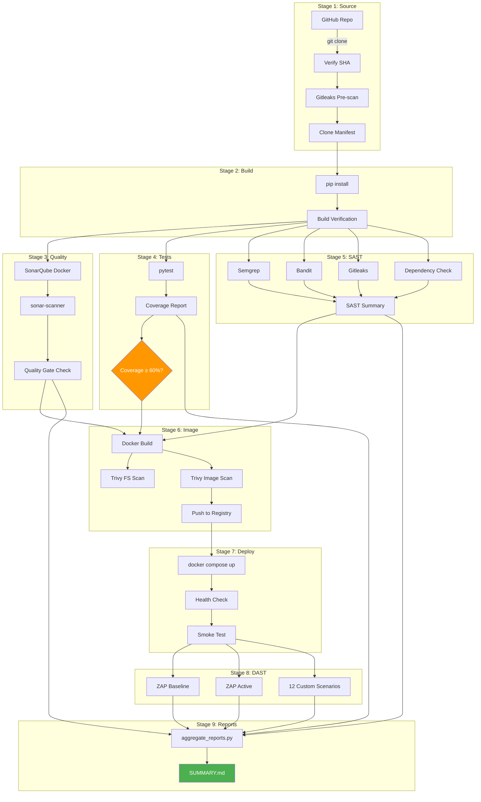

# 00 — Architecture

## Pipeline Overview



## Data Flow

```
┌─────────────┐    ┌─────────────┐    ┌─────────────┐
│  GitHub     │    │  CI Runner  │    │  Services    │
│  (source)   │───▶│  (actions)  │───▶│  (compose)   │
└─────────────┘    └─────────────┘    └─────────────┘
                         │                    │
                         ▼                    ▼
                   ┌─────────────┐    ┌─────────────┐
                   │  Reports/   │    │  Docker      │
                   │  artifacts  │    │  Registry    │
                   └─────────────┘    └─────────────┘
```

## Components

| Component | Role | Port | Technology |
|-----------|------|------|------------|
| **Conduit App** | Target web application | 8080 | Flask 2.x + Gunicorn |
| **PostgreSQL** | Application database | 5432 | PostgreSQL 16 Alpine |
| **SonarQube** | Code quality analysis | 9000 | SonarQube Community Edition |
| **Docker Registry** | Container artifact storage | 5000 | registry:2 |
| **OWASP ZAP** | Dynamic security testing | ephemeral | owasp/zap2docker-stable |
| **GitHub Actions** | CI/CD orchestrator | N/A | ubuntu-22.04 runners |
| **Trivy** | Container vulnerability scanner | N/A | aquasecurity/trivy |

## Environment Variables

All configuration flows through environment variables (see `.env.example`):

| Variable | Purpose | Required |
|----------|---------|----------|
| `TARGET_REPO` | GitHub repo to clone | Yes |
| `TARGET_COMMIT` | Pinned commit SHA | Yes |
| `SONAR_HOST_URL` | SonarQube server URL | Yes |
| `SONAR_TOKEN` | SonarQube auth token | Yes |
| `SECRET_KEY` | Flask app secret | Yes |
| `MIN_COVERAGE` | Coverage threshold (%) | No (default 60) |
| `REGISTRY_URL` | Docker registry URL | No (default localhost:5000) |
| `ZAP_API_KEY` | ZAP API key (optional) | No |

## Security Architecture

The pipeline implements **Shift Left Security**:

1. **Pre-commit:** Gitleaks hooks catch secrets before they reach the repo
2. **CI on push:** Stages 1-5 run automatically — SAST, tests, quality gates
3. **CD on merge to main:** Stages 6-8 deploy to test env, run DAST
4. **Nightly:** Full DAST active scan + dependency check on schedule
5. **Reports:** Every run produces timestamped, browsable artifacts
