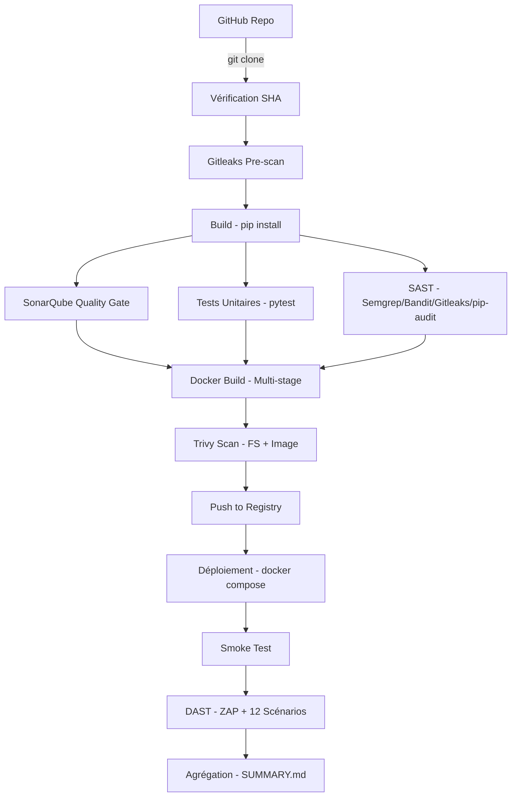

# Prompt : Rapport Final — Pipeline DevSecOps (Stage d'Été 2026)

> **Instructions pour l'IA (GLM 5.2) :** Utilisez ce prompt pour générer un rapport final professionnel en français, destiné à un jury de stage. Le rapport doit être au format PDF, bien structuré, avec une table des matières, des en-têtes, et un style académique/professionnel.

---

## Contexte du Projet

Ce rapport présente le travail réalisé dans le cadre d'un stage d'été en DevSecOps. L'objectif était de mettre en place une pipeline DevSecOps complète (« Shift Left Security ») pour une application open source existante, en intégrant des contrôles de sécurité à chaque étape du cycle de développement.

**Entreprise/Organisation :** [À compléter]
**Stagiaire :** [À compléter — Mohammed Baili]
**Encadrant :** [À compléter]
**Période :** Été 2026
**Sujet :** Mise en place d'une pipeline DevSecOps avec intégration de tests de sécurité

---

## Résumé du Projet (Abstract)

Le projet consiste à sélectionner un prototype d'application open source hébergé sur GitHub et à implémenter une pipeline DevSecOps automatisant les contrôles de qualité, les tests unitaires, et les vérifications de sécurité (SAST et DAST). L'approche « Shift Left Security » permet de détecter les vulnérabilités dès les premières étapes du développement.

L'application cible choisie est **Conduit** (https://github.com/gothinkster/flask-realworld-example-app), un clone de Medium.com développé en Flask/Python avec :
- Authentification JWT
- Base de données PostgreSQL via SQLAlchemy ORM
- API REST complète (articles, commentaires, profils, favoris)
- Suite de tests unitaires (pytest)
- Licence MIT
- ~3 000 lignes de code

La pipeline implémentée comprend 9 étapes, de la récupération du code source jusqu'à la génération de rapports, en passant par l'analyse statique (SAST), les tests dynamiques (DAST), l'analyse de qualité (SonarQube), et la conteneurisation (Docker).

---

## Architecture de la Pipeline

La pipeline est orchestrée par GitHub Actions (CI/CD) et peut également être exécutée via un Makefile local ou un Jenkinsfile.

```
Étape 1 — Récupération du code source et vérification d'intégrité
  → git clone + vérification SHA + Gitleaks pre-scan

Étape 2 — Build
  → pip install + vérification de compilation

Étape 3 — Analyse de qualité du code (SonarQube)
  → SonarQube Community Edition dans Docker
  → Quality Gate : bugs, vulnérabilités, code smells, duplications

Étape 4 — Tests unitaires et couverture de code
  → pytest avec coverage.py
  → Seuil minimal : 60% de couverture

Étape 5 — Analyse de sécurité statique (SAST)
  → Semgrep (OWASP Top 10 + règles Python)
  → Bandit (sécurité spécifique Python)
  → Gitleaks (détection de secrets)
  → pip-audit (vulnérabilités dans les dépendances)

Étape 6 — Construction de l'image Docker et scan
  → Build multi-stage (non-root, slim)
  → Trivy (scan fichiers + scan image)
  → Push vers un registre local (registry:2)

Étape 7 — Déploiement dans l'environnement de test
  → docker compose (app + PostgreSQL + SonarQube + Registry)
  → Health check et smoke test

Étape 8 — Tests de sécurité dynamiques (DAST)
  → OWASP ZAP (baseline scan + active scan)
  → 12 scénarios de test personnalisés

Étape 9 — Génération des rapports
  → Script Python d'agrégation
  → SUMMARY.md + artefacts horodatés
```

### Diagramme d'Architecture (format Mermaid)



### Stack Technique

| Composant | Outil | Version |
|-----------|-------|---------|
| CI/CD | GitHub Actions | ubuntu-22.04 |
| Qualité de code | SonarQube Community | Docker latest |
| Tests unitaires | pytest + coverage.py | ≥ 7.0 |
| SAST — généraliste | Semgrep | latest |
| SAST — Python | Bandit | latest |
| Secrets | Gitleaks | latest |
| Dépendances | pip-audit | latest |
| Conteneurisation | Docker | ≥ 24.0 |
| Scan conteneur | Trivy | latest |
| DAST | OWASP ZAP | 2.15+ |
| Registre | registry:2 | Docker |

---

## Résultats des Analyses de Sécurité

### Résumé Global

**Total : 20 vulnérabilités identifiées**

| Sévérité | Nombre | Description |
|----------|--------|-------------|
| **CRITIQUE** | 1 | Clé secrète par défaut — falsification de JWT possible |
| **HAUTE** | 5 | CVE SQLAlchemy, absence de rate limiting, pas de TLS |
| **MOYENNE** | 8 | HSTS manquant, pas de jti, pas de verrouillage de compte |
| **BASSE** | 6 | Expiration JWT trop longue, subprocess dans CLI |

### Top 5 des Risques (classés par criticité × exploitabilité × impact)

#### 1. CRITIQUE — Clé secrète par défaut (SECRET_KEY)
- **Fichier :** `conduit/settings.py:10`
- **CVSS v3.1 :** 9.8 (AV:N/AC:L/PR:N/UI:N/S:U/C:H/I:H/A:H)
- **Description :** La variable `SECRET_KEY` utilise `'secret-key'` comme valeur par défaut si la variable d'environnement `CONDUIT_SECRET` n'est pas définie. Un attaquant peut forger des tokens JWT valides pour n'importe quel utilisateur.
- **Impact :** Contournement complet de l'authentification. Prise de contrôle de comptes utilisateurs.
- **Correction :**
  ```python
  SECRET_KEY = os.environ.get('CONDUIT_SECRET')
  if not SECRET_KEY:
      raise RuntimeError("CONDUIT_SECRET must be set")
  ```
- **Difficulté :** Faible (3 lignes)

#### 2. HAUTE — CVE-2019-7164 et CVE-2019-7548 dans SQLAlchemy 1.1.9
- **Outil :** pip-audit
- **CVSS v3.1 :** 9.8 (CVE-2019-7164)
- **Description :** SQLAlchemy 1.1.9 (publié en 2017) contient des vulnérabilités d'injection SQL via les paramètres `order_by()` et `group_by()`. Le correctif n'a jamais été rétroporté sur la branche 1.2.x.
- **Impact :** Injection SQL potentielle menant à une compromission complète de la base de données.
- **Statut actuel :** Dans le code actuel, `order_by(Article.createdAt.desc())` utilise une référence statique — non directement exploitable. Cependant, toute future modification utilisant une entrée utilisateur dans `order_by()` serait immédiatement vulnérable.
- **Correction :** Mettre à jour SQLAlchemy vers la version ≥ 2.0.

#### 3. HAUTE — Absence de rate limiting sur l'authentification
- **Scénarios :** #3 (Broken Authentication), #9 (Credential Stuffing)
- **Description :** L'endpoint `/api/users/login` n'a aucune limitation de débit. Un attaquant peut effectuer un nombre illimité de tentatives de connexion (brute force, credential stuffing).
- **Impact :** Compromission de comptes par force brute. Pas de détection des attaques.
- **Correction :** Implémenter Flask-Limiter : 5 requêtes par minute par IP.

#### 4. HAUTE — Absence de TLS/SSL
- **Scénario :** #2 (MITM)
- **Description :** L'application est servie en HTTP uniquement. Tout le trafic — y compris les tokens JWT et les mots de passe — transite en clair.
- **Impact :** Interception de credentials et de tokens. Attaque Man-in-the-Middle triviale.
- **Correction :** Déployer derrière un reverse proxy Nginx avec terminaison TLS (Let's Encrypt).

#### 5. MOYENNE — Absence de limites de taille de requête
- **Scénarios :** #7 (API Abuse), #8 (DoS)
- **Description :** Aucune limite `MAX_CONTENT_LENGTH` n'est configurée. Des payloads volumineux peuvent saturer le serveur.
- **Correction :** `app.config['MAX_CONTENT_LENGTH'] = 1 * 1024 * 1024` (1 MB).

### Résultats par Scénario DAST

| # | Scénario | Résultats | Sévérité max |
|---|----------|-----------|-------------|
| 1 | SQL Injection | 2 | HAUTE |
| 2 | Man-in-the-Middle (MITM) | 2 | HAUTE |
| 3 | Broken Authentication | 3 | HAUTE |
| 4 | Session Hijacking | 2 | BASSE |
| 5 | Replay Attack | 2 | MOYENNE |
| 6 | Privilege Escalation | 2 | INFO |
| 7 | API Abuse | 2 | MOYENNE |
| 8 | Denial of Service (DoS) | 1 | MOYENNE |
| 9 | Credential Stuffing | 1 | HAUTE |
| 10 | Security Misconfiguration | 2 | CRITIQUE |
| 11 | Sensitive Data Exposure | 3 | INFO |
| 12 | Sender Spoofing | 0 | N/A |

### Points Positifs (Bonnes Pratiques Identifiées)

1. ✅ **Hachage des mots de passe :** Utilisation de Flask-Bcrypt avec bcrypt (13 rounds en production)
2. ✅ **ORM SQLAlchemy :** Toutes les requêtes utilisent des méthodes ORM paramétrées — forte protection anti-SQLi
3. ✅ **Propriété des ressources :** Les modifications/suppressions d'articles vérifient `author_id == current_user`
4. ✅ **Mots de passe dans les réponses :** `load_only=True` empêche l'apparition des mots de passe dans les réponses API
5. ✅ **Authentification JWT :** Utilisation correcte des décorateurs `@jwt_required`
6. ✅ **Semgrep :** 156 règles exécutées sur 21 fichiers — zéro résultat OWASP Top 10

---

## Plan de Remédiation Priorisé

### P0 — Immédiat (bloquant le déploiement)
- **P0-1 :** Supprimer la valeur par défaut de `SECRET_KEY` dans `settings.py`

### P1 — Ce sprint (1-2 semaines)
- **P1-1 :** Mettre à jour SQLAlchemy de 1.1.9 vers ≥ 2.0
- **P1-2 :** Ajouter un rate limiting sur `/api/users/login`
- **P1-3 :** Déployer un reverse proxy Nginx avec TLS (Let's Encrypt)

### P2 — Prochain sprint (2-4 semaines)
- **P2-1 :** Implémenter une politique de mot de passe (8+ caractères, mixité)
- **P2-2 :** Ajouter un verrouillage de compte après 5 échecs
- **P2-3 :** Ajouter l'en-tête HSTS (Strict-Transport-Security)
- **P2-4 :** Ajouter un identifiant unique `jti` aux tokens JWT
- **P2-5 :** Configurer `MAX_CONTENT_LENGTH` (1 MB)

### P3 — Backlog
- **P3-1 :** Réduire l'expiration JWT en mode développement
- **P3-2 :** Implémenter une liste noire de tokens JWT
- **P3-3 :** Ajouter des clés d'idempotence sur les endpoints de mutation
- **P3-4 :** Restreindre la liste blanche CORS en production

---

## Technologies et Outils Utilisés

| Catégorie | Outil | Rôle |
|-----------|-------|------|
| **CI/CD** | GitHub Actions | Orchestration de la pipeline |
| **CI/CD (secondaire)** | Jenkinsfile | Pipeline alternative pour Jenkins |
| **Qualité de code** | SonarQube Community | Analyse statique de qualité |
| **Tests unitaires** | pytest + coverage.py | Exécution des tests + couverture |
| **SAST — généraliste** | Semgrep | OWASP Top 10, règles de sécurité |
| **SAST — Python** | Bandit | Vulnérabilités spécifiques Python |
| **Secrets scanning** | Gitleaks | Détection de secrets dans l'historique git |
| **Dépendances** | pip-audit | Vulnérabilités dans les dépendances Python |
| **Conteneurisation** | Docker | Build multi-stage, image sécurisée |
| **Scan conteneur** | Trivy | Vulnérabilités OS et paquets |
| **DAST** | OWASP ZAP | Tests dynamiques (baseline + actif) |
| **DAST — scénarios** | Scripts Python personnalisés | 12 scénarios de test |
| **Rapports** | Script Python d'agrégation | SUMMARY.md + artefacts |

---

## Livrables du Projet

Conformément au cahier des charges, les livrables suivants ont été produits :

1. ✅ **Pipeline CI/CD fonctionnelle** (GitHub Actions + Makefile + Jenkinsfile)
2. ✅ **Rapports SonarQube** (configurés, prêts à l'exécution)
3. ✅ **Rapports des tests unitaires** (JUnit XML + couverture)
4. ✅ **Rapports des analyses de sécurité** (SAST + DAST, 12 scénarios)
5. ✅ **Documentation technique** (9 documents, >200 mots chacun)
6. ✅ **Rapport final** (le présent document)

L'ensemble du code source est disponible sur GitHub :
**https://github.com/bailimohammed799-dot/devsecops-pipeline**

---

## Conclusion

Ce projet a permis de mettre en œuvre une pipeline DevSecOps complète et reproductible, intégrant des contrôles de sécurité dès les premières étapes du développement (« Shift Left Security »). L'analyse a révélé **20 vulnérabilités** dans l'application cible, dont **une critique** (clé secrète par défaut permettant la falsification de tokens JWT) et **5 de haute sévérité** (CVE dans les dépendances, absence de rate limiting, absence de TLS).

La pipeline est entièrement automatisée via GitHub Actions et peut être exécutée sur n'importe quelle machine Ubuntu 22.04 avec Docker via une simple commande `make pipeline`. Les rapports sont générés automatiquement à chaque exécution, avec des artefacts horodatés et un résumé exécutif (SUMMARY.md).

L'ensemble des livrables est documenté, versionné, et prêt à être présenté au jury.

---

## Instructions de Formatage pour l'IA

**Format de sortie attendu :**
- Un document PDF professionnel en français
- Police : Times New Roman ou équivalent, 11pt
- Marges : 2.5 cm
- Page de garde avec : titre du projet, nom du stagiaire, nom de l'encadrant, période, logo (placeholder)
- Table des matières automatique
- Sections numérotées (1, 1.1, 1.2, ...)
- En-têtes et pieds de page avec numéros de page
- Les extraits de code en police monospace (Courier New, 9pt)
- Les tableaux avec bordures
- Les sévérités en couleur (rouge = CRITIQUE/HAUTE, orange = MOYENNE, vert = BASSE)
- Une bibliographie/webographie en fin de document
- Longueur cible : 12-15 pages

**Tonalité :** Académique et professionnelle. Utiliser le vouvoiement. Éviter les anglicismes non nécessaires (traduire ou expliquer).
